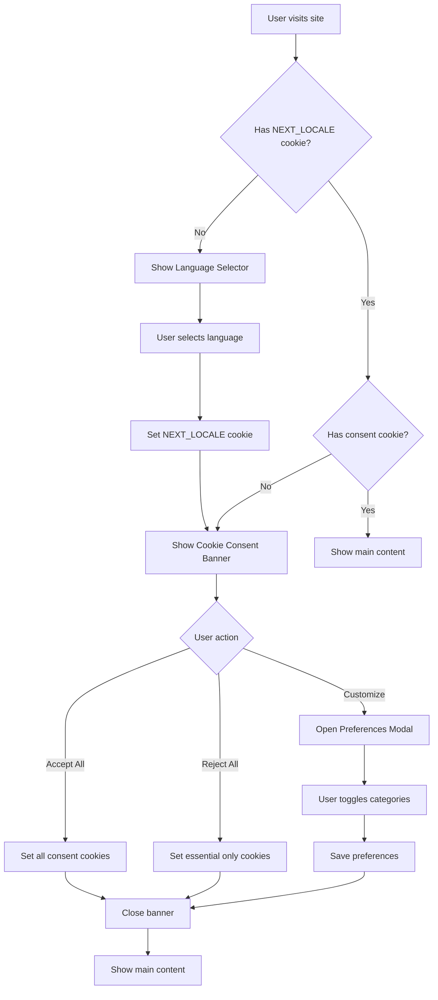
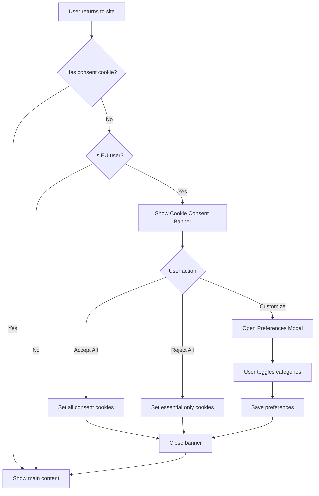
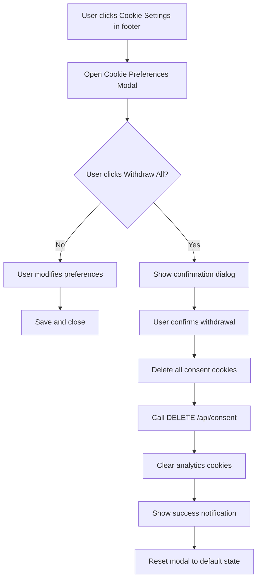
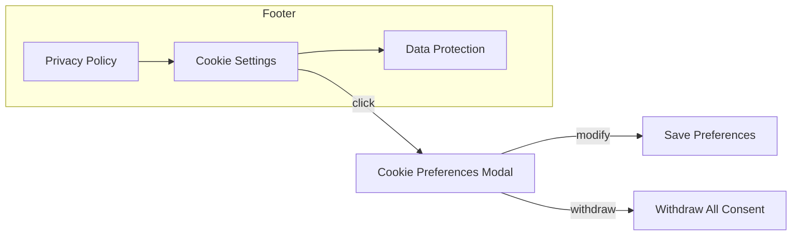

# Cookie Consent UI/UX Strategy Design Document

**Document Version:** 1.0  
**Created:** January 2026  
**Status:** Design Phase - Ready for Implementation  
**Related Issue:** Issue 5 - Cookie Consent Non-Compliance (Audit Report)

---

## 1. Executive Summary

This document provides a comprehensive UI/UX design strategy for implementing GDPR-compliant cookie consent in the Foodbrain application. The current implementation violates the ePrivacy Directive by automatically setting non-essential cookies upon language selection without explicit user consent for each cookie category.

### Current State Analysis

The existing [`LanguageSelectorPopup.tsx`](src/components/LanguageSelectorPopup.tsx) component combines language selection with legal acceptance, automatically setting the `legal_accepted` cookie (lines 127-128) when a user selects their language. This approach violates GDPR requirements because:

- **Implicit consent**: Non-essential cookies are set without explicit opt-in
- **No granular options**: Users cannot consent to specific cookie categories
- **Missing Reject All**: Only "Accept All" behavior is available
- **No withdrawal mechanism**: Users cannot withdraw consent once given
- **Pre-ticked categories**: All non-essential cookies are enabled by default

### Design Objective

Create a separate, GDPR-compliant cookie consent system that:
1. Provides equal prominence to "Accept All" and "Reject All" options
2. Offers granular cookie category controls with all non-essential categories pre-unticked
3. Enables immediate consent withdrawal through a footer link
4. Maximizes data collection through persuasive but compliant copy
5. Supports English, Spanish, and Greek translations

---

## 2. Component Architecture

### 2.1 New Component Structure

```
src/components/
├── CookieConsentBanner.tsx      # Main banner for first-time visitors
├── CookiePreferencesModal.tsx   # Granular preferences modal
└── CookieSettingsLink.tsx       # Footer link to open preferences

src/hooks/
├── useCookieConsent.ts          # Hook for managing consent state
└── useHasCookieConsent.ts       # Hook to check if consent exists

src/lib/
├── cookie-manager.ts            # Cookie utilities and consent management
└── analytics.ts                 # Conditional analytics initialization

src/app/api/consent/
└── route.ts                     # API endpoints for consent persistence

src/app/[locale]/
├── layout.tsx                   # Include CookieConsentBanner
└── (legal)/
    └── cookie-policy/
        └── page.tsx             # Updated with consent management info
```

### 2.2 Component Relationships

```mermaid
graph TB
    subgraph Client Components
        LSW[LanguageSelectorWrapper] -->|wraps| LSP[LanguageSelectorPopup]
        LSP -->|checks| HC[useHasCookieConsent]
        CB[CookieConsentBanner] -->|uses| CC[useCookieConsent]
        CPM[CookiePreferencesModal] -->|uses| CC[useCookieConsent]
        CSL[CookieSettingsLink] -->|opens| CPM[CookiePreferencesModal]
    end
    
    subgraph Hooks
        HC -->|reads| CM[cookie-manager]
        CC -->|manages| CM
    end
    
    subgraph Server
        CM -->|persists| API[/api/consent]
        API -->|stores| DB[(Database)]
    end
    
    subgraph Layout Integration
        RL[Root Layout] -->|includes| CB
        RL -->|includes| CSL
    end
```

### 2.3 CookieConsentBanner Component

**File:** [`src/components/CookieConsentBanner.tsx`](src/components/CookieConsentBanner.tsx)

**Props Interface:**
```typescript
interface CookieConsentBannerProps {
  isVisible: boolean;
  onAcceptAll: () => void;
  onRejectAll: () => void;
  onCustomize: () => void;
  position: 'bottom' | 'top' | 'center-modal';
}
```

**Visual Layout:**
```
┌─────────────────────────────────────────────────────────────────────┐
│  🍪  We value your privacy                                           │
├─────────────────────────────────────────────────────────────────────┤
│  We use cookies to enhance your experience. Essential cookies are   │
│  always active, and you can choose to enable other types.           │
│                                                                     │
│  [ Accept All ]    [ Reject All ]    [ Customize ]                  │
│  ─────────────────────────────────────────────────────────────────  │
│  Read our Cookie Policy to learn more                               │
└─────────────────────────────────────────────────────────────────────┘
```

### 2.4 CookiePreferencesModal Component

**File:** [`src/components/CookiePreferencesModal.tsx`](src/components/CookiePreferencesModal.tsx)

**Props Interface:**
```typescript
interface CookiePreferencesModalProps {
  isOpen: boolean;
  onClose: () => void;
  onSave: (preferences: CookiePreferences) => void;
  initialPreferences?: CookiePreferences;
}
```

**Modal Sections:**
1. **Essential Cookies** (read-only, always active)
2. **Functional Cookies** (toggle, pre-unticked)
3. **Analytics Cookies** (toggle, pre-unticked)
4. **Marketing Cookies** (toggle, pre-unticked)

---

## 3. User Flow Design

### 3.1 First Visit Flow



### 3.2 Return Visit Flow



### 3.3 Consent Withdrawal Flow



### 3.4 Footer Integration Flow



---

## 4. Visual Design Recommendations

### 4.1 Banner Design Specifications

**Dimensions:**
- Width: 100% on mobile, max-width 600px on desktop
- Height: Auto-adjust based on content
- Padding: 24px

**Colors:**
- Background: White or light neutral (#FFFFFF or #F8FAFC)
- Text: Primary dark (#1E293B)
- Border: Subtle (#E2E8F0)
- Shadows: Medium (box-shadow: 0 4px 6px -1px rgba(0, 0, 0, 0.1))

**Button Styling:**
```css
.btn-accept-all,
.btn-reject-all {
  padding: 12px 24px;
  border-radius: 8px;
  font-weight: 600;
  font-size: 14px;
  min-width: 140px;
  /* Equal prominence - same size, similar visual weight */
}

.btn-accept-all {
  background: #10B981;  /* Green - positive action */
  color: white;
  border: 2px solid #10B981;
}

.btn-reject-all {
  background: white;
  color: #64748B;       /* Neutral - equal visual prominence */
  border: 2px solid #E2E8F0;
}

.btn-customize {
  background: transparent;
  color: #3B82F6;       /* Blue - secondary action */
  border: none;
  text-decoration: underline;
}
```

### 4.2 Modal Design Specifications

**Modal Dimensions:**
- Width: 90% on mobile, max-width 500px on desktop
- Max-height: 80vh with overflow-y: auto
- Border-radius: 12px

**Toggle Switch Design:**
```css
.toggle-switch {
  position: relative;
  width: 48px;
  height: 24px;
  background: #E2E8F0;  /* OFF state color */
  border-radius: 24px;
  cursor: pointer;
  transition: background 0.2s;
}

.toggle-switch.active {
  background: #10B981;  /* ON state color */
}

.toggle-switch::after {
  content: '';
  position: absolute;
  top: 2px;
  left: 2px;
  width: 20px;
  height: 20px;
  background: white;
  border-radius: 50%;
  transition: transform 0.2s;
}

.toggle-switch.active::after {
  transform: translateX(24px);
}
```

### 4.3 Visual Hierarchy

**Primary Actions (Equal Prominence):**
```
┌─────────────────┐  ┌─────────────────┐
│    Accept All   │  │    Reject All   │
└─────────────────┘  └─────────────────┘
```
- Same dimensions (140px × 48px)
- "Accept" uses filled primary color
- "Reject" uses outlined neutral style
- Both equally visible in initial view

**Secondary Action:**
```
[ Customize ]
```
- Text link style
- Located below primary buttons
- Blue color for discoverability

### 4.4 Accessibility Requirements

| Requirement | Implementation |
|-------------|----------------|
| Keyboard navigation | All interactive elements focusable with Tab |
| ARIA labels | Proper labels for toggles and buttons |
| Screen readers | Descriptive text for cookie categories |
| Color contrast | Minimum 4.5:1 ratio for text |
| Focus indicators | Visible focus rings on all interactive elements |

---

## 5. Copy Recommendations

### 5.1 Banner Copy

#### English (EN)
```json
{
  "cookieConsent": {
    "title": "We value your privacy",
    "description": "We use cookies to enhance your experience. Essential cookies are always active, and you can choose to enable or disable other types of cookies.",
    "acceptAll": "Accept All",
    "rejectAll": "Reject All",
    "customize": "Customize",
    "learnMore": "Read our Cookie Policy"
  }
}
```

#### Spanish (ES)
```json
{
  "cookieConsent": {
    "title": "Valoramos su privacidad",
    "description": "Utilizamos cookies para mejorar su experiencia. Las cookies esenciales siempre están activas y puede elegir habilitar o deshabilitar otros tipos.",
    "acceptAll": "Aceptar Todo",
    "rejectAll": "Rechazar Todo",
    "customize": "Personalizar",
    "learnMore": "Lea nuestra Política de Cookies"
  }
}
```

#### Greek (EL)
```json
{
  "cookieConsent": {
    "title": "Εκτιμούμε το απόρρητό σας",
    "description": "Χρησιμοποιούμε cookies για να βελτιώσουμε την εμπειρία σας. Τα απαραίτητα cookies είναι πάντα ενεργά και μπορείτε να επιλέξετε να ενεργοποιήσετε ή να απενεργοποιήσετε άλλους τύπους.",
    "acceptAll": "Αποδοχή Όλων",
    "rejectAll": "Απόρριψη Όλων",
    "customize": "Προσαρμογή",
    "learnMore": "Διαβάστε την Πολιτική Cookies"
  }
}
```

### 5.2 Category Descriptions

#### Essential Cookies (Always Active)
**English:** "Required for the website to function properly. These include language preference and security cookies."

**Spanish:** "Requeridos para que el sitio web funcione correctamente. Incluyen cookies de preferencia de idioma y seguridad."

**Greek:** "Απαιτούνται για τη σωστή λειτουργία του ιστότοπου. Περιλαμβάνουν cookies προτίμησης γλώσσας και ασφάλειας."

#### Functional Cookies (Pre-unticked)
**English:** "Remember your preferences and settings for a personalized experience. Remembers your language, font size, and display preferences."

**Spanish:** "Recuerdan sus preferencias y configuraciones para una experiencia personalizada. Recordará su idioma, tamaño de fuente y preferencias de pantalla."

**Greek:** "Θυμούνται τις προτιμήσεις και ρυθμίσεις σας για μια εξατομικευμένη εμπειρία. Θυμάται τη γλώσσα, το μέγεθος γραμματοσειράς και τις προτιμήσεις οθόνης."

#### Analytics Cookies (Pre-unticked)
**English:** "Help us improve our website by showing us which pages are most popular and how visitors move around the site. This helps us create a better experience for everyone."

**Spanish:** "Nos ayudan a mejorar nuestro sitio web mostrándonos las páginas más populares y cómo los visitantes navegan por el sitio. Esto nos ayuda a crear una mejor experiencia para todos."

**Greek:** "Μας βοηθούν να βελτιώσουμε τον ιστότοπό μας δείχνοντάς μας τις πιο δημοφιλείς σελίδες και πώς οι επισκέπτες περιηγούνται στον ιστότοπο. Αυτό μας βοηθά να δημιουργήσουμε μια καλύτερη εμπειρία για όλους."

#### Marketing Cookies (Pre-unticked)
**English:** "Enable personalized recommendations and relevant content based on your interests. Helps us show you content that matters to you."

**Spanish:** "Habilitan recomendaciones personalizadas y contenido relevante según sus intereses. Nos ayuda a mostrarle contenido que le importa."

**Greek:** "Ενεργοποιούν εξατομικευμένες συστάσεις και σχετικό περιεχόμενο με βάση τα ενδιαφέροντά σας. Μας βοηθά να σας δείξουμε περιεχόμενο που έχει σημασία για εσάς."

### 5.3 Data Maximization Copy Strategies

#### Analytics Cookies - Benefit-Framed Copy
**Headline:** "Help us create a better experience for everyone"

**Supporting text:**
- "Shows us which features are most popular"
- "Identifies pages that need improvement"
- "Helps us optimize website speed"
- "Fixes technical issues faster"

**Visual cue:** Use a lightbulb or chart icon to represent improvement

#### Marketing Cookies - Value Proposition
**Headline:** "Get recommendations that matter to you"

**Supporting text:**
- "Content tailored to your interests"
- "Relevant suggestions based on your preferences"
- "Never miss information that's important to you"

**Visual cue:** Use a star or heart icon to represent personalization

#### Functional Cookies - Convenience Focus
**Headline:** "Remember your settings so you don't have to"

**Supporting text:**
- "Your preferences are saved automatically"
- "No need to adjust settings every visit"
- "Consistent experience across pages"

**Visual cue:** Use a gear or settings icon to represent customization

---

## 6. Internationalization Requirements

### 6.1 Translation Keys Structure

```json
{
  "cookieConsent": {
    "banner": {
      "title": "We value your privacy",
      "description": "We use cookies to enhance your experience...",
      "acceptAll": "Accept All",
      "rejectAll": "Reject All",
      "customize": "Customize",
      "learnMore": "Learn More"
    },
    "modal": {
      "title": "Cookie Preferences",
      "description": "Manage your cookie settings...",
      "save": "Save Preferences",
      "withdraw": "Withdraw All Consent",
      "categories": {
        "essential": {
          "title": "Essential Cookies",
          "description": "Required for the website to function...",
          "alwaysActive": "Always active"
        },
        "functional": {
          "title": "Functional Cookies",
          "description": "Remember your preferences..."
        },
        "analytics": {
          "title": "Analytics Cookies",
          "description": "Help us improve our website..."
        },
        "marketing": {
          "title": "Marketing Cookies",
          "description": "Enable personalized recommendations..."
        }
      }
    },
    "footer": {
      "linkText": "Cookie Settings"
    },
    "notifications": {
      "accepted": "Cookie preferences saved",
      "withdrawn": "Consent withdrawn successfully"
    }
  }
}
```

### 6.2 Complete Translations

#### English (en.json)
```json
{
  "cookieConsent": {
    "banner": {
      "title": "We value your privacy",
      "description": "We use cookies to enhance your experience. Essential cookies are always active, and you can choose to enable or disable other types of cookies.",
      "acceptAll": "Accept All",
      "rejectAll": "Reject All",
      "customize": "Customize",
      "learnMore": "Read our Cookie Policy"
    },
    "modal": {
      "title": "Cookie Preferences",
      "description": "Manage which cookies you want to enable. Essential cookies are always active as they are required for the website to function.",
      "save": "Save Preferences",
      "withdraw": "Withdraw All Consent",
      "confirmWithdraw": "Are you sure you want to withdraw consent? This will disable all non-essential cookies.",
      "categories": {
        "essential": {
          "title": "Essential Cookies",
          "description": "Required for the website to function properly. These include language preference and security cookies.",
          "alwaysActive": "Always active"
        },
        "functional": {
          "title": "Functional Cookies",
          "description": "Remember your preferences and settings for a personalized experience."
        },
        "analytics": {
          "title": "Analytics Cookies",
          "description": "Help us improve our website by showing us which pages are most popular and how visitors move around the site."
        },
        "marketing": {
          "title": "Marketing Cookies",
          "description": "Enable personalized recommendations and relevant content based on your interests."
        }
      }
    },
    "footer": {
      "linkText": "Cookie Settings"
    },
    "notifications": {
      "accepted": "Cookie preferences saved successfully",
      "withdrawn": "Consent withdrawn. All non-essential cookies have been disabled."
    }
  }
}
```

#### Spanish (es.json)
```json
{
  "cookieConsent": {
    "banner": {
      "title": "Valoramos su privacidad",
      "description": "Utilizamos cookies para mejorar su experiencia. Las cookies esenciales siempre están activas y puede elegir habilitar o deshabilitar otros tipos de cookies.",
      "acceptAll": "Aceptar Todo",
      "rejectAll": "Rechazar Todo",
      "customize": "Personalizar",
      "learnMore": "Lea nuestra Política de Cookies"
    },
    "modal": {
      "title": "Preferencias de Cookies",
      "description": "Administre qué cookies desea habilitar. Las cookies esenciales siempre están activas ya que son necesarias para el funcionamiento del sitio web.",
      "save": "Guardar Preferencias",
      "withdraw": "Retirar Todo el Consentimiento",
      "confirmWithdraw": "¿Está seguro de que desea retirar el consentimiento? Esto deshabilitará todas las cookies no esenciales.",
      "categories": {
        "essential": {
          "title": "Cookies Esenciales",
          "description": "Requeridas para que el sitio web funcione correctamente. Incluyen cookies de preferencia de idioma y seguridad.",
          "alwaysActive": "Siempre activo"
        },
        "functional": {
          "title": "Cookies Funcionales",
          "description": "Recuerdan sus preferencias y configuraciones para una experiencia personalizada."
        },
        "analytics": {
          "title": "Cookies de Analítica",
          "description": "Nos ayudan a mejorar nuestro sitio web mostrándonos las páginas más populares y cómo los visitantes navegan por el sitio."
        },
        "marketing": {
          "title": "Cookies de Marketing",
          "description": "Habilitan recomendaciones personalizadas y contenido relevante según sus intereses."
        }
      }
    },
    "footer": {
      "linkText": "Configuración de Cookies"
    },
    "notifications": {
      "accepted": "Preferencias de cookies guardadas correctamente",
      "withdrawn": "Consentimiento retirado. Todas las cookies no esenciales han sido deshabilitadas."
    }
  }
}
```

#### Greek (el.json)
```json
{
  "cookieConsent": {
    "banner": {
      "title": "Εκτιμούμε το απόρρητό σας",
      "description": "Χρησιμοποιούμε cookies για να βελτιώσουμε την εμπειρία σας. Τα απαραίτητα cookies είναι πάντα ενεργά και μπορείτε να επιλέξετε να ενεργοποιήσετε ή να απενεργοποιήσετε άλλους τύπους.",
      "acceptAll": "Αποδοχή Όλων",
      "rejectAll": "Απόρριψη Όλων",
      "customize": "Προσαρμογή",
      "learnMore": "Διαβάστε την Πολιτική Cookies"
    },
    "modal": {
      "title": "Προτιμήσεις Cookies",
      "description": "Διαχειριστείτε ποια cookies θέλετε να ενεργοποιήσετε. Τα απαραίτητα cookies είναι πάντα ενεργά καθώς απαιτούνται για τη λειτουργία του ιστότοπου.",
      "save": "Αποθήκευση Προτιμήσεων",
      "withdraw": "Ανάκληση Όλων των Συναινέσεων",
      "confirmWithdraw": "Είστε σίγουροι ότι θέλετε να ανακαλέσετε τη συναίνεση; Αυτό θα απενεργοποιήσει όλα τα μη απαραίτητα cookies.",
      "categories": {
        "essential": {
          "title": "Απαραίτητα Cookies",
          "description": "Απαιτούνται για τη σωστή λειτουργία του ιστότοπου. Περιλαμβάνουν cookies προτίμησης γλώσσας και ασφάλειας.",
          "alwaysActive": "Πάντα ενεργό"
        },
        "functional": {
          "title": "Λειτουργικά Cookies",
          "description": "Θυμούνται τις προτιμήσεις και ρυθμίσεις σας για μια εξατομικευμένη εμπειρία."
        },
        "analytics": {
          "title": "Αναλυτικά Cookies",
          "description": "Μας βοηθούν να βελτιώσουμε τον ιστότοπό μας δείχνοντάς μας τις πιο δημοφιλείς σελίδες και πώς οι επισκέπτες περιηγούνται στον ιστότοπο."
        },
        "marketing": {
          "title": "Cookies Μάρκετινγκ",
          "description": "Ενεργοποιούν εξατομικευμένες συστάσεις και σχετικό περιεχόμενο με βάση τα ενδιαφέροντά σας."
        }
      }
    },
    "footer": {
      "linkText": "Ρυθμίσεις Cookies"
    },
    "notifications": {
      "accepted": "Οι προτιμήσεις cookies αποθηκεύτηκαν επιτυχώς",
      "withdrawn": "Η συναίνεση ανακλήθηκε. Όλα τα μη απαραίτητα cookies έχουν απενεργοποιηθεί."
    }
  }
}
```

---

## 7. Implementation Tasks

### Phase 1: Foundation
| Task | File | Priority |
|------|------|----------|
| Create cookie-manager utility | `src/lib/cookie-manager.ts` | HIGH |
| Create useCookieConsent hook | `src/hooks/useCookieConsent.ts` | HIGH |
| Create consent API route | `src/app/api/consent/route.ts` | HIGH |
| Update database schema | `prisma/schema.prisma` | HIGH |

### Phase 2: UI Components
| Task | File | Priority |
|------|------|----------|
| Create CookieConsentBanner | `src/components/CookieConsentBanner.tsx` | HIGH |
| Create CookiePreferencesModal | `src/components/CookiePreferencesModal.tsx` | HIGH |
| Create CookieSettingsLink | `src/components/CookieSettingsLink.tsx` | MEDIUM |
| Update LanguageSelectorPopup | `src/components/LanguageSelectorPopup.tsx` | HIGH |

### Phase 3: Integration
| Task | File | Priority |
|------|------|----------|
| Add banner to root layout | `src/app/layout.tsx` | HIGH |
| Add footer settings link | `src/components/Footer.tsx` | MEDIUM |
| Implement consent checking | `src/hooks/useHasCookieConsent.ts` | HIGH |
| Block analytics until consent | `src/lib/analytics.ts` | HIGH |

### Phase 4: Translations
| Task | File | Priority |
|------|------|----------|
| Add EN cookie consent strings | `messages/en.json` | HIGH |
| Add ES cookie consent strings | `messages/es.json` | HIGH |
| Add EL cookie consent strings | `messages/el.json` | HIGH |

### Phase 5: Testing
| Task | Description | Priority |
|------|-------------|----------|
| GDPR compliance audit | Verify no cookies before consent | HIGH |
| Visual regression test | Compare button prominence | MEDIUM |
| Accessibility audit | Test keyboard navigation | MEDIUM |
| Cross-browser testing | Verify all browsers | LOW |

---

## 8. Success Metrics

### Compliance Metrics
| Metric | Target | Measurement |
|--------|--------|-------------|
| Cookie Compliance Score | 100% | Audit checklist |
| Consent Granularity | 4 categories | Feature verification |
| Reject All Button | Equal prominence | Visual inspection |
| Withdrawal Mechanism | < 2 clicks | User flow test |

### User Experience Metrics
| Metric | Target | Measurement |
|--------|--------|-------------|
| Consent Rate | > 60% analytics | A/B test |
| Customization Rate | > 20% | Analytics |
| Banner Dismissal | < 3 seconds | UX test |
| Footer Link Clicks | > 5% | Analytics |

---

## 9. Related Files

| File | Purpose |
|------|---------|
| [`docs/COOKIE_CONSENT_REQUIREMENTS.md`](docs/COOKIE_CONSENT_REQUIREMENTS.md) | Technical specifications |
| [`docs/GDPR.md`](docs/GDPR.md) | GDPR compliance documentation |
| [`src/components/LanguageSelectorPopup.tsx`](src/components/LanguageSelectorPopup.tsx) | Current implementation (to be updated) |
| [`src/hooks/useHasLegalAcceptance.ts`](src/hooks/useHasLegalAcceptance.ts) | Current hook (to be refactored) |
| [`messages/en.json`](messages/en.json) | English translations |
| [`messages/es.json`](messages/es.json) | Spanish translations |
| [`messages/el.json`](messages/el.json) | Greek translations |

---

*Document prepared for Foodbrain development team*  
*Design Standard: GDPR (EU) 2016/679 + ePrivacy Directive 2002/58/EC*
